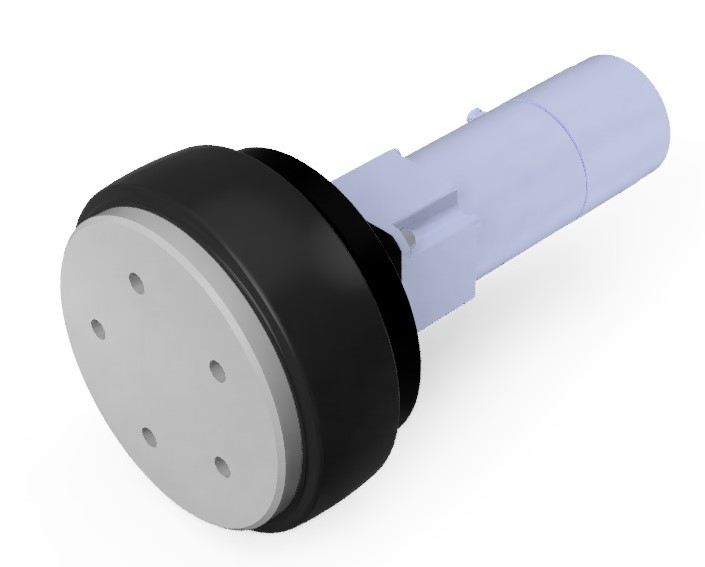

[](https://github.com/HarvestX/SU065-D4380-ROS2/actions/workflows/ci_galactic.yml)
[](https://github.com/HarvestX/SU065-D4380-ROS2/actions/workflows/ci_humble.yml)

# SU065-D4380-ROS2
Nidec Motor Driver interface for ROS2



## Requirements
- ROS 2
  - Ubuntu20 : [Galactic Geochelone](https://docs.ros.org/en/galactic/Installation.html)
  - Ubuntu22 : [Humble Hawksbill](https://docs.ros.org/en/humble/Installation.html)

## Setup
Add user to dialout group.
```bash
sudo adduser $USER dialout
```
User will need to log out & log back in again for this to take effect.

## Install
### Locate package in workspace
```bash
mkdir -p ~/<Your Workspace>/src
cd ~/<Your Workspace>/src
git clone git@github.com:HarvestX/SU065-D4380-ROS2.git
```

### Install dependencies
```bash
source /opt/ros/galactic/setup.bash
cd ~/<Your Workspace>
rosdep update
rosdep install -r -y -i --from-paths ./src/SU065-D4380-ROS2 --rosdistro $ROS_DISTRO
```

### Build source
```bash
cd ~/<Your Workspace>
colcon build
```

# References
- [Nidec](https://www.nidec-shimpo.co.jp/en/)
